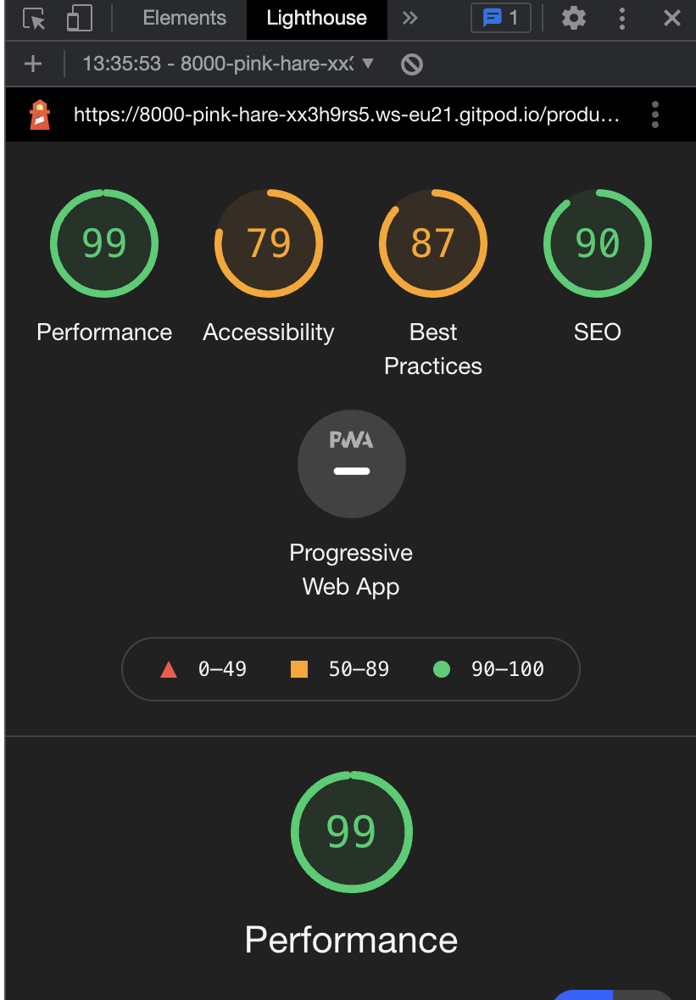
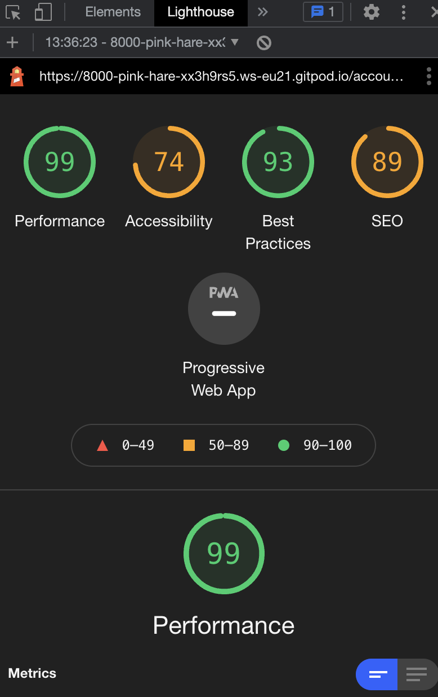
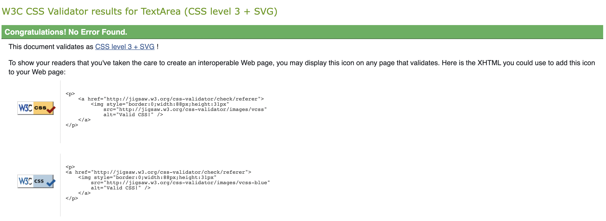
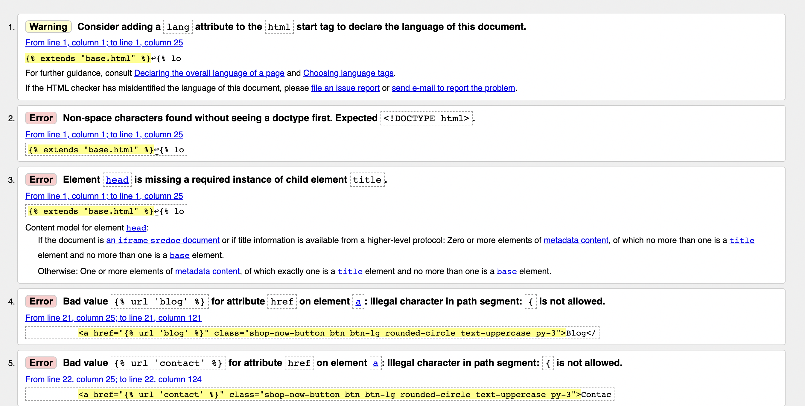
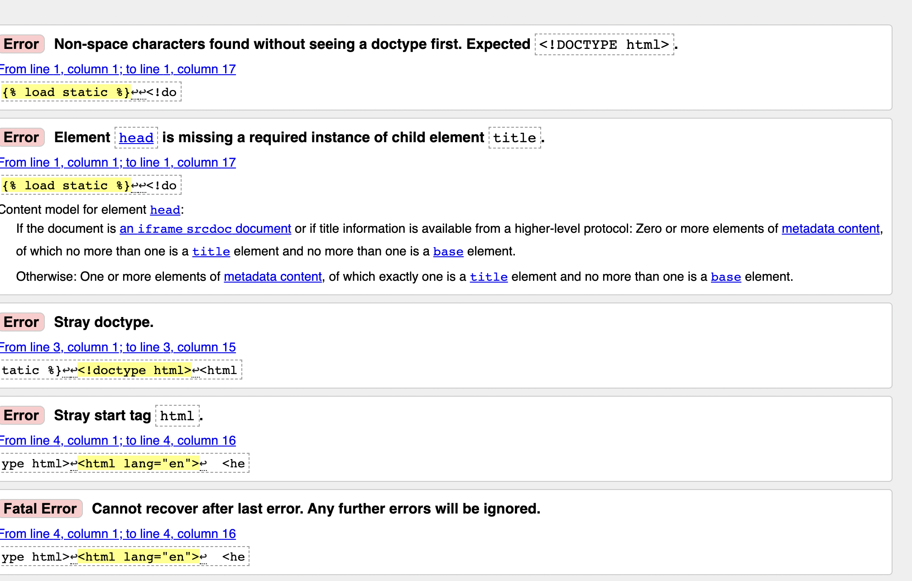
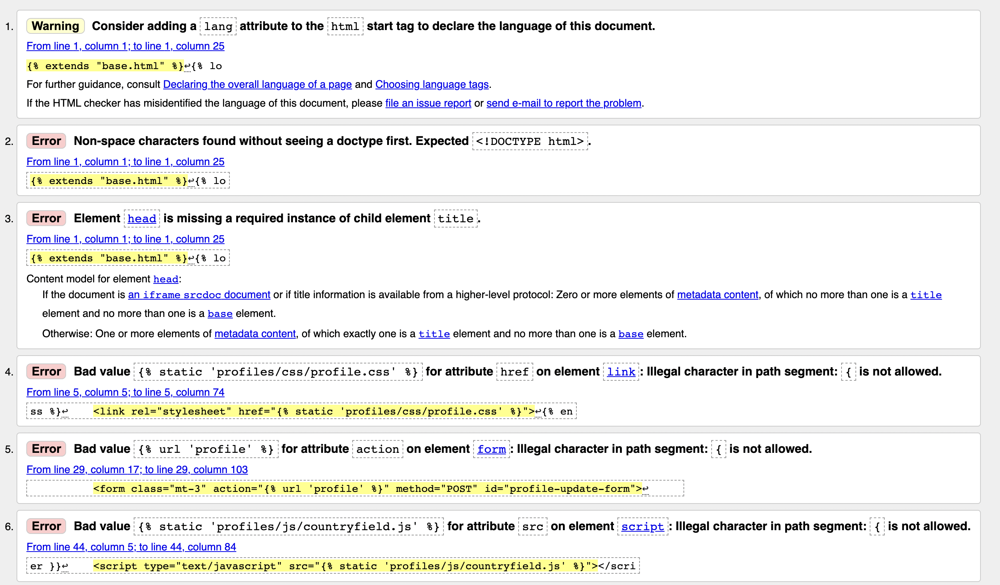
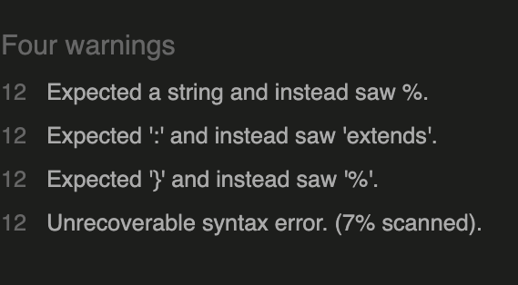
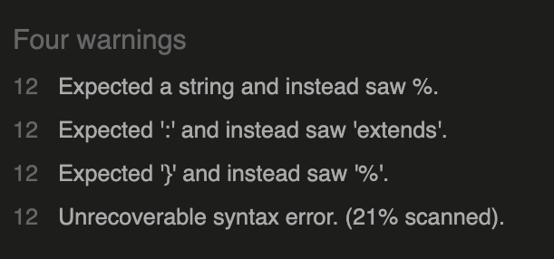
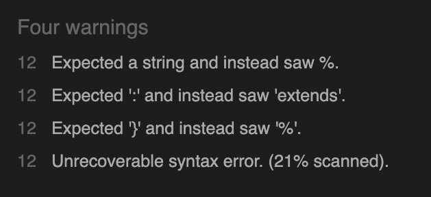

<h1 align="center">Jewellery Store Website</h1>

This is a hypothetical site for an individual hancrafted jewellery store.

## User Experience (UX)

-   ### User stories

    -   #### First Time Visitor Goals

        1. As a First Time Visitor, I want to easily understand the main purpose of the site and learn more about the company.
        2. As a First Time Visitor, I want to be able to easily navigate throughout the site to find content.
        3. As a First Time Visitor, I would like a blog/review page to see what other people think of the products.
        4. As a First Time Visitor, I want an easy clean safe way to purchase items.
        5. As a First Time Visitor, I want to be able to create and account.

    -   #### Returning Visitor Goals

        1. As a Returning Visitor, I want the website to stay consistent in terms of of feel and navigation.
        2. As a Returning Visitor, I want to have a way to contact the company in case there is issues with a previous order or a general inquiry.
        3. As a Returning Visitor, I want to be able to easily login to my account.
        
    -   #### Frequent User Goals
        1. As a Frequent User, I want to have full and easy access to my account inlcuding being able to delete my account.
        2. As a Frequent User, I want to check to see if there are any new blog posts.
        3. As a Frequent User, I want to be able to add my own blog posts and keep up to date with the community.

-   ### Design
    -   #### Colour Scheme
        -   The two main colours used are black and white.
    -   #### Typography
        -   
    -   #### Imagery
        -   Imagery is important. The large, background hero image is designed to to match the aesthetic of the company and provide a clean stylish look.

*   ### Wireframes

    - [Desktop](media/Desktop.png)

    - [Mobile](media/Mobile.png)

    - [Tablet](media/Tablet.png)
## Features

-   Responsive on all device sizes

-   Create profile.

-   Add blog posts and interact with the community.

-   Store itemns in bag with ability to continue viewing.

-   Secure safe checkout procedure.

## Technologies Used

### Languages Used

-   [HTML5](https://en.wikipedia.org/wiki/HTML5)
-   [CSS3](https://en.wikipedia.org/wiki/Cascading_Style_Sheets)

### Frameworks, Libraries & Programs Used

1. [Bootstrap 4.4.1:](https://getbootstrap.com/docs/4.4/getting-started/introduction/)
    - Bootstrap was used to assist with the responsiveness and styling of the website.
1. [Font Awesome:](https://fontawesome.com/)
    - Font Awesome was used on all pages throughout the website to add icons for aesthetic and UX purposes.
1. [jQuery:](https://jquery.com/)
    - jQuery came with Bootstrap to make the navbar responsive but was also used for the smooth scroll function in JavaScript.
1. [Git](https://git-scm.com/)
    - Git was used for version control by utilizing the Gitpod terminal to commit to Git and Push to GitHub.
1. [GitHub:](https://github.com/)
    - GitHub is used to store the projects code after being pushed from Git.
1. [Balsamiq:](https://balsamiq.com/)
    - Balsamiq was used to create the wireframes during the design process.  
1. [Django:](https://www.djangoproject.com/)
    - High-level Python web framework.

### Lighthouse Testing 




### Validation Testing 















### Testing User Stories from User Experience (UX) Section

-   #### First Time Visitor Goals

    1. As a First Time Visitor, I want to easily understand the main purpose of the site and learn more about the company.

        1. Upon entering the site, users are automatically greeted with a clean and easily readable navigation bar to go to the page of their choice. Underneath there is a Hero Image.
        2. The main points are made immediately with the hero image
        3. The user can view the blog or enter the contact page from the buttons on the hero image or they can browse products clearly seen in the navbar.

    2. As a First Time Visitor, I want to be able to easily be able to navigate throughout the site to find content.

        1. As this is a small hancrafted jewellery store users can see all products available in the navbar as well as the option to view all products. A search bar is also included to help navigation.

    3. As a First Time Visitor, I would like a blog/review page to see what other people think of the products.
        1. The blog page is located on a button from the hero image where users can click and view blogs from other site users. They also have the option to post their own blog once registered.

    4. As a First Time Visitor, I want an easy clean safe way to purchase items.
        1. Secure and clean and easy readable checkout is provided for users when purchasing an item.

    5. As a First Time Visitor, I want to be able to create and account.
        1. This can be done and seen easiy above the nav with the account option which uses font imagery to clearly show users where this feature is located.
    

-   #### Returning Visitor Goals

    1. As a Returning Visitor, I want the website to stay consistent in terms of of feel and navigation.

        1. Site stays consistant with aesthetic and color scheme throughout with select pages keeping the stylish hero image while others like checkout pages do not as to keep these features more simple and clean.

    2. As a Returning Visitor, I want to have a way to contact the company in case there is issues with a previous order or a general inquiry.

        1. Clearly located on the hero image of the home page is a "Contact Us" for user support.

    3. As a Returning Visitor, I want to be able to easily login to my account.
        
        1. Account feature stays consistent throughout the site and is easily seen using font imagery.

-   #### Frequent User Goals

    1. As a Frequent User, I want to have full and easy access to my account inlcuding being able to delete my account.

        1. All can be done through the account feature and is easy to follow steps needed to perform any task.

    2. As a Frequent User, I want to check to see if there are any new blog posts.

        1. The blog button is located on the hero image and is updated by date of all new blogs posted.

    3. As a Frequent User, I want to be able to add my own blog posts and keep up to date with the community.

        1. This can be done via the add blog feature shown on the blog page.

## Deployment

### GitHub Pages

The project was deployed to GitHub Pages using the following steps...

1. Log in to GitHub and locate the [GitHub Repository](https://github.com/)
2. At the top of the Repository (not top of page), locate the "Settings" Button on the menu.
    - Alternatively Click [Here](https://raw.githubusercontent.com/) for a GIF demonstrating the process starting from Step 2.
3. Scroll down the Settings page until you locate the "GitHub Pages" Section.
4. Under "Source", click the dropdown called "None" and select "Master Branch".
5. The page will automatically refresh.
6. Scroll back down through the page to locate the now published site [link](https://github.com) in the "GitHub Pages" section.

### Forking the GitHub Repository

By forking the GitHub Repository we make a copy of the original repository on our GitHub account to view and/or make changes without affecting the original repository by using the following steps...

1. Log in to GitHub and locate the [GitHub Repository](https://github.com/)
2. At the top of the Repository (not top of page) just above the "Settings" Button on the menu, locate the "Fork" Button.
3. You should now have a copy of the original repository in your GitHub account.

### Making a Local Clone

1. Log in to GitHub and locate the [GitHub Repository](https://github.com/)
2. Under the repository name, click "Clone or download".
3. To clone the repository using HTTPS, under "Clone with HTTPS", copy the link.
4. Open Git Bash
5. Change the current working directory to the location where you want the cloned directory to be made.
6. Type `git clone`, and then paste the URL you copied in Step 3.

```
$ git clone https://github.com/YOUR-USERNAME/YOUR-REPOSITORY
```

7. Press Enter. Your local clone will be created.

```
$ git clone https://github.com/YOUR-USERNAME/YOUR-REPOSITORY
> Cloning into `CI-Clone`...
> remote: Counting objects: 10, done.
> remote: Compressing objects: 100% (8/8), done.
> remove: Total 10 (delta 1), reused 10 (delta 1)
> Unpacking objects: 100% (10/10), done.
```

Click [Here](https://help.github.com/en/github/creating-cloning-and-archiving-repositories/cloning-a-repository#cloning-a-repository-to-github-desktop) to retrieve pictures for some of the buttons and more detailed explanations of the above process.

### Heroku

1. Install PostgreSQL support: pip3 install psycopg2-binary and pip3 install dj-database-url.
2. Update the Heroku requirements file: pip3 freeze > requirements.txt
3. Add PostgreSQL add-on on Heroku under Application -> Resources -> Add-ons: Heroku Postgres (free / hobby tier). Heroku adds a DATABASE_URL variable under Application -> Settings -> Config Vars. Copy this URL.
4. Add the URL to the ‘.env’ file: DATABASE_URL=<Database URL>. Update ‘settings.py’.
5. Migrate the Django Models to the PostgreSQL Database:.
6. Update the allowed hosts in ‘settings.py’: ALLOWED_HOSTS = [os.environ.get('ALLOWED_HOSTS')].
7. VS Code: Create the commit message. Changes -> Stage All Changes, Commit -> Commit All, Push.


## Credits

### Code

-   [Bootstrap4](https://getbootstrap.com/docs/4.4/getting-started/introduction/): Bootstrap Library used throughout the project mainly to make site responsive using the Bootstrap Grid System.

### Content

-  All content and and products were made up for hypothetical site.


### Media

-   [Pexels:](https://https://www.pexels.com//)

### Acknowledgements

-   My Mentor for continuous helpful feedback.

-   Slack community.

-   Tutor support at Code Institute for their support.